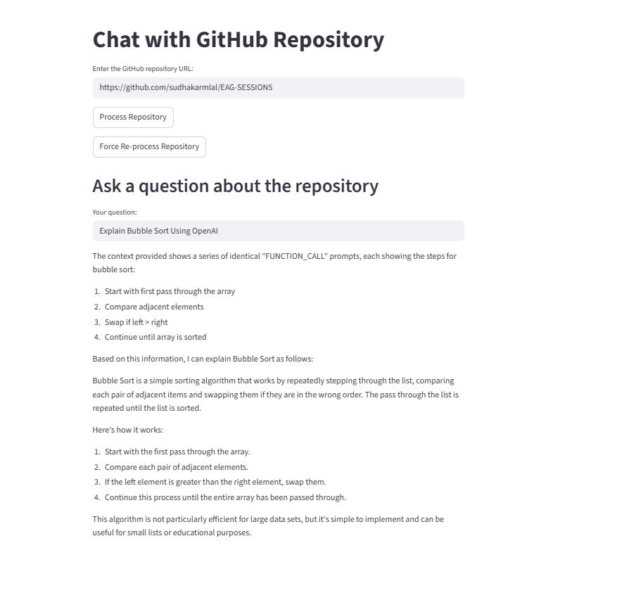
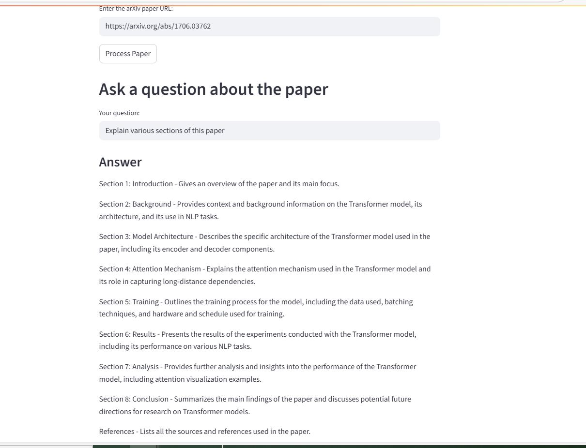

# Chat with GitHub Repository using Ollama Llama3 and FAISS

Ytube URL:
https://www.youtube.com/watch?v=rQRAv925pjI




This application allows you to chat with the contents of any public GitHub repository. It uses [Ollama](https://ollama.com/) to run the Llama3 language model locally and [FAISS](https://github.com/facebookresearch/faiss) for efficient document retrieval. The app is built with [Streamlit](https://streamlit.io/) for an interactive web interface.

---

## Features
- **Clone any public GitHub repository** by URL
- **Index all text/code files** using FAISS and Llama3 embeddings
- **Ask questions** about the repository and get context-aware answers
- **Caching**: Repositories are indexed only once for fast repeated queries
- **Progress bar** and status updates during processing

---

## Requirements
- Python 3.9+
- [Ollama](https://ollama.com/) installed and running locally
- Llama3 model pulled via Ollama

---

## Installation

1. **Clone this repository** (or download the code):
    ```bash
    git clone <this-repo-url>
    cd <this-repo-directory>
    ```

2. **Install Python dependencies:**
    ```bash
    pip install -r requirements.txt
    ```

3. **Install and start Ollama:**
    - Download and install Ollama from [https://ollama.com/](https://ollama.com/)
    - Pull the Llama3 model:
      ```bash
      ollama pull llama3
      ```
    - Start Ollama (if not already running):
      ```bash
      ollama run llama3
      ```

---

## Usage

1. **Start the Streamlit app:**
    ```bash
    streamlit run main.py
    ```

2. **In your browser:**
    - Enter the URL of a public GitHub repository (e.g., `https://github.com/fastai/fastai`)
    - Click **Process Repository**
    - Wait for the progress bar to complete (first time only; subsequent loads are instant)
    - Ask questions about the repository in the chat box

3. **Re-indexing:**
    - If the repository changes or you want to re-index, use the **Force Re-process Repository** button.

---

## Troubleshooting

- **Ollama not running:**
  - Make sure you have started Ollama and the Llama3 model is loaded (`ollama run llama3`).
- **Processing is slow:**
  - The first time you process a large repository, embedding generation can take several minutes. Subsequent queries are fast.
- **Error deleting repo:**
  - On Windows, file locks may prevent deletion. You can safely ignore or manually delete the folder if needed.
- **App hangs on question:**
  - Ensure Ollama is running and not busy. Limit the number of context chunks (see code comments).

---

## How it Works

1. **Cloning:** The app clones the specified GitHub repository into the current directory.
2. **Document Loading:** All text/code files are loaded and split into manageable chunks.
3. **Embedding & Indexing:** Each chunk is embedded using Llama3 via Ollama, and stored in a FAISS vector database.
4. **Chat:** When you ask a question, the app retrieves the most relevant chunks and uses Llama3 to generate an answer.

---

## License
This project is for educational and research purposes. Please respect the licenses of any repositories you process. 

=====================================================================================================================


# arXiv Q&A with FAISS & Streamlit



This project allows you to chat with research papers from arXiv. It downloads a paper, stores its content in a FAISS vector database, and uses a Large Language Model (LLM) to answer your questions about it through a user-friendly web interface.

## Setup

1.  **Install dependencies:**
    
    ```bash
    pip install -r requirements.txt
    ```
    
2.  **Set up your environment:**
    
    *   Create a file named `.env` in the project directory.
    *   Add your OpenAI API key to this file:
        
        ```
        OPENAI_API_KEY="your_openai_api_key_here"
        ```
    *   If you prefer not to use a `.env` file, you can enter the API key directly in the web application.

## How to Run

1.  **Run the Streamlit app:**
    
    ```bash
    streamlit run arxiv_faiss_qa.py
    ```
    
2.  **Use the Application:**
    
    *   Open the URL provided by Streamlit in your web browser.
    *   Enter your OpenAI API key (if not already set in your environment).
    *   Enter the URL of an arXiv paper. Example: `https://arxiv.org/abs/1706.03762`.
    *   Click "Process Paper" and wait for it to be indexed.
    *   Once processed, ask your questions in the text box and get answers from the paper. 
