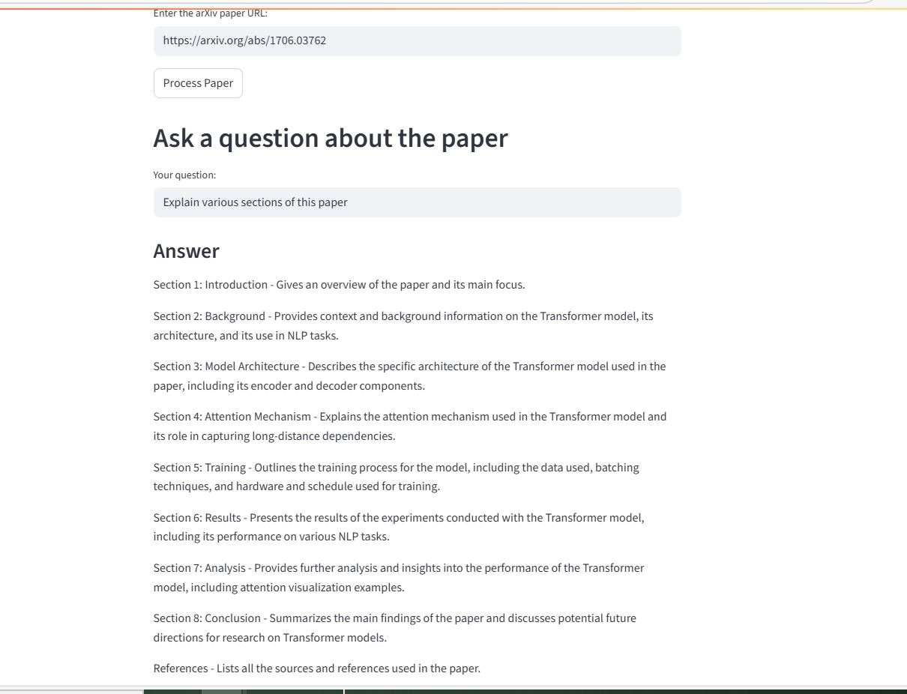

# arXiv Q&A with FAISS & Streamlit

Ytube URL: https://youtu.be/DPxrQD9GbSs



This project allows you to chat with research papers from arXiv. It downloads a paper, stores its content in a FAISS vector database, and uses a Large Language Model (LLM) to answer your questions about it through a user-friendly web interface.

## Setup

1.  **Install dependencies:**
    
    ```bash
    pip install -r requirements.txt
    ```
    
2.  **Set up your environment:**
    
    *   Create a file named `.env` in the project directory.
    *   Add your OpenAI API key to this file:
        
        ```
        OPENAI_API_KEY="your_openai_api_key_here"
        ```
    *   If you prefer not to use a `.env` file, you can enter the API key directly in the web application.

## How to Run

1.  **Run the Streamlit app:**
    
    ```bash
    streamlit run arxiv_faiss_qa.py
    ```
    
2.  **Use the Application:**
    
    *   Open the URL provided by Streamlit in your web browser.
    *   Enter your OpenAI API key (if not already set in your environment).
    *   Enter the URL of an arXiv paper. Example: `https://arxiv.org/abs/1706.03762`.
    *   Click "Process Paper" and wait for it to be indexed.
    *   Once processed, ask your questions in the text box and get answers from the paper. 
